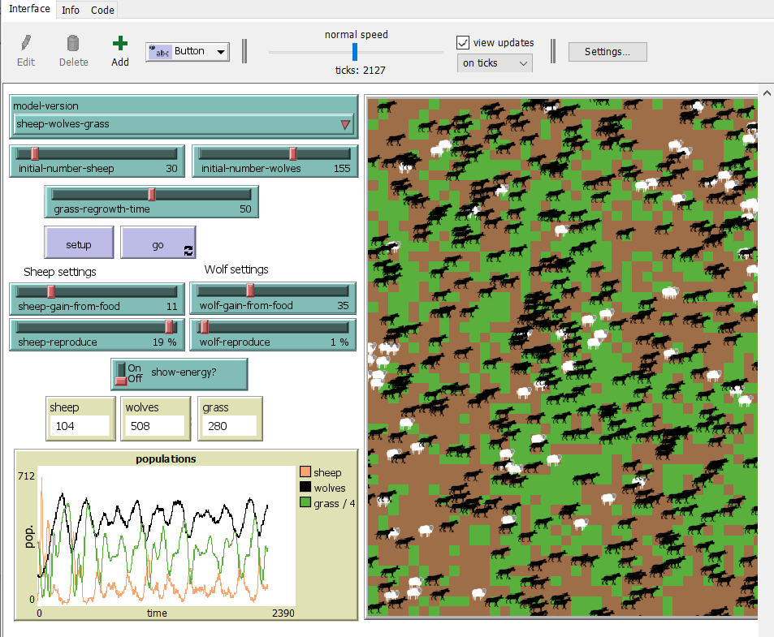

## Комп'ютерні системи імітаційного моделювання
## СПм-23-5, **Чхеідзе Важа Олександрович**
### Лабораторна робота №**3**. Використання засобів обчислювального интелекту для оптимізації імітаційних моделей

 

### Варіант 7, модель у середовищі NetLogo:
[Wolf Sheep Predation](http://www.netlogoweb.org/launch#http://www.netlogoweb.org/assets/modelslib/Sample%20Models/Biology/Wolf%20Sheep%20Predation.nlogo).

 

### Вербальний опис моделі:

Модель описана у [першій лабораторній](https://github.com/Formandk/KSIM_lab_1).

### Налаштування середовища BehaviorSearch:

**Обрана модель**:
<pre>
C:\Program Files\NetLogo 6.3.0\models\Sample Models\Biology\Wolf Sheep Predation.nlogo
</pre>
**Параметри моделі** (вкладка Model):  
<pre>
["initial-number-sheep" [1 1 250]]
["sheep-gain-from-food" [1 1 50]]
["sheep-reproduce" [1 1 20]]
["initial-number-wolves" [1 1 250]]
["wolf-gain-from-food" [1 1 100]]
["wolf-reproduce" [1 1 20]]
["grass-regrowth-time" [0 1 100]]
["show-energy?" false]
["model-version" "sheep-wolves-grass"]
</pre>

Використовувана **міра**:  :
Для фітнес-функції було обрано **співвідношення вовків та овець**. Це значення береться з імітаційної моделі (також додано частину *(ticks * 100 / 100000)*, щоб переконатись, що екосистема стійка і протриматься більше 1 000 тіків) в середовищі NetLogo та вказано у параметрі "**Measure**":
<pre>
(count wolves / count sheep) * (ticks * 100 / 100000)
</pre>
Співвідношення вовків та овець враховується **в середньому** за весь період симуляції тривалістю, 1 000 тактів, починаючи з 0 такту симуляції.  
Параметр зупинки за умовою ("**Stop if**") встановлено у значення, коли симуляція зупиняється, коли овець або менше 10 або більше 2000, щоб сильно не перегружати пк:
<pre>
count sheep < 10 or count sheep > 2000
</pre>

Загальний вигляд вкладки налаштувань параметрів моделі:

**Налаштування цільової функції** (вкладка Search Objective):  
Метою підбору параметрів імітаційної моделі є **максимізація** значення співвідношення вовків та овець – це вказано через параметр "**Goal**" зі значенням **Maximize Fitness**. Тобто необхідно визначити такі параметри налаштувань моделі, у яких менша кількість овець зможе підтримувати більшу кількість вовків. При цьому цікавить не просто співвідношення вовків та овець у якийсь окремий момент симуляції, а середнє його значення за всю симуляцію. Для цього у параметрі "**Collected measure**", що визначає спосіб обліку значень обраного показника, вказано **MEAN_ACROSS_STEPS**.  
Щоб уникнути викривлення результатів через випадкові значення, що використовуються в логіці самої імітаційної моделі, **кожна симуляція повторюється по 5 разів**, результуюче значення розраховується як **середнє арифметичне**. 
Загальний вигляд вкладки налаштувань цільової функції:

**Налаштування алгоритму пошуку** (вкладка Search Algorithm):  
Загальний вид вкладки налаштувань алгоритму пошуку: 

 

### Результати використання BehaviorSearch:
Діалогове вікно запуску пошуку 

Результат пошуку параметрів імітаційної моделі, використовуючи **генетичний алгоритм**:

Результат пошуку параметрів імітаційної моделі, використовуючи **випадковий пошук**:

 

Генетичний алгоритм впорався куди краще з підбором параметрів. Екосистема стійка і в деякі моменти може піддержувати співвідношення 5 вовків до 1 вівці:

 
